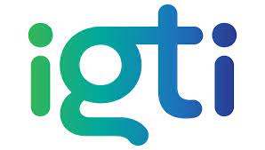
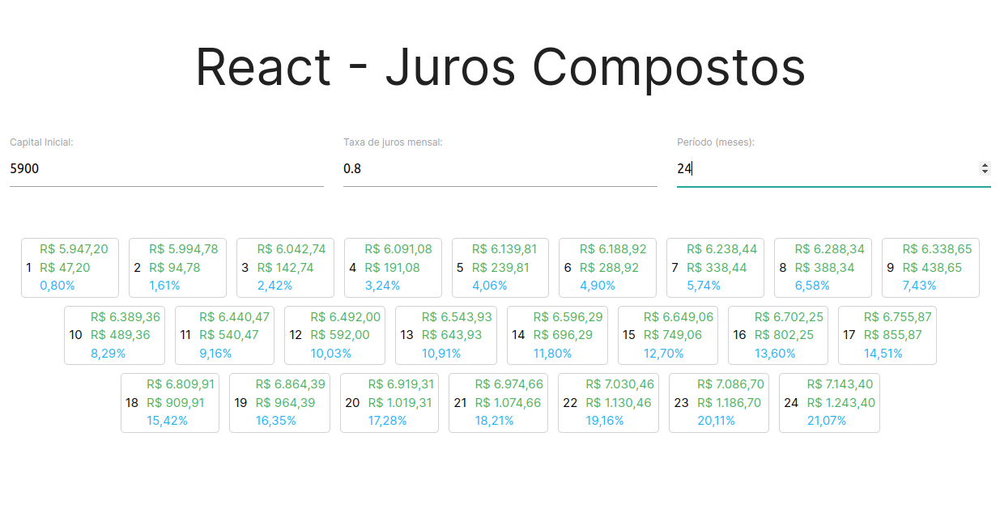

<h1 align="center">
  
</h1>

<p align="center">
  <a href="#-projeto">Projeto</a>&nbsp;&nbsp;&nbsp;|&nbsp;&nbsp;&nbsp;
  <a href="#-tecnologias">Tecnologias</a>
 </p>

<br>

## <p align="center"><b>D01-M03-IGTI</b></p>

<br>

<p align="center">
  
</p>

<br>

## 💻 Projeto

O React - Juros Compostos (Desafio do Módulo 3 - Bootcamp FullStack IGTI) é um desafio com objetivo de praticar o React aprendido no módulo 3 do bootcamp, nessa desafio é construído um mini-sistema que calcula o juros compostos seja para depreciação quanto para valorização, onde são mostradas todas as parcelas com infomações como: montante atual da parcela, valor acrescido desde o capital inicial, juros acrescido em relação ao capital inicial.

Para iniciar a aplicação:

```bash
npm start
```

E acessar no navegador com:

```bash
http://localhost:3000/
```

<br>

## ✨ Tecnologias

Esse projeto foi desenvolvido com as seguintes tecnologias:

- HTML
- CSS
- JavaScript
- React

---
